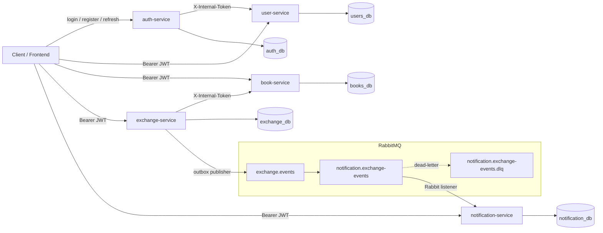
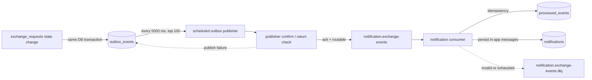
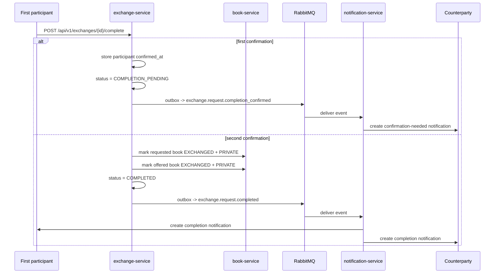

# Second Shelf

Second Shelf is a multi-module Spring Boot backend for book exchange between users.
The final practical-part architecture consists of five services with isolated
PostgreSQL databases, direct REST calls without an API gateway, JWT-based
authentication for public APIs, `X-Internal-Token` protection for private
service APIs, RabbitMQ delivery for exchange domain events, and persisted
in-app notifications built through the outbox pattern.

## Documentation

- [Security documentation pack](docs/security/README.md)

## Project Structure

| Service | Port | Responsibility | Database |
| --- | --- | --- | --- |
| `auth-service` | `8080` | Registration, login, access token issuing, refresh rotation, logout, logout-all | `auth_db` |
| `user-service` | `8081` | User profiles, roles, block/unblock, internal claims/auth APIs | `users_db` |
| `book-service` | `8082` | Public catalog, owner book management, internal book state transitions | `books_db` |
| `exchange-service` | `8083` | Exchange request state machine, synchronous book coordination, outbox event creation and publishing | `exchange_db` |
| `notification-service` | `8084` | RabbitMQ event consumption and persisted user notifications | `notification_db` |

Maven root modules:

- `auth-service`
- `user-service`
- `book-service`
- `exchange-service`
- `notification-service`

## Final Architecture

### Synchronous REST Boundaries

- There is no API gateway in this repository. Clients call each service directly.
- `auth-service` owns registration, login, refresh rotation, logout, logout-all,
  and `GET /api/auth/me`.
- `user-service` owns user profiles, administrator role management, and
  account blocking/unblocking.
- `book-service` owns the public catalog and owner-side book CRUD and
  visibility operations for `AVAILABLE` books, while exchange-driven reserve /
  release / exchanged transitions happen through internal endpoints.
- `exchange-service` owns the exchange request workflow and coordinates book
  reservation/release/completion through synchronous internal calls to
  `book-service`.
- `notification-service` only exposes stored notification APIs; it does not call
  other services.

### JWT And Internal Security

- `auth-service` issues:
  - HMAC-signed JWT access tokens;
  - opaque refresh tokens generated with `SecureRandom`.
- Access token claims currently include:
  - `sub`
  - `userId`
  - `roles`
- `user-service`, `book-service`, `exchange-service`, and
  `notification-service` validate JWTs locally with the shared `JWT_SECRET`.
  There is no central token introspection endpoint.
- Refresh tokens are not stored in plain text. `auth-service` stores only
  HMAC-SHA-256 hashes protected with server-side pepper in
  `auth_db.refresh_tokens`.
- Refresh rotates the token pair: the previous refresh token is revoked, a new
  refresh token is persisted in the same token family, and a new access token
  is minted from current claims loaded from `user-service`.
- Reuse of an already revoked refresh token marks the family for audit and
  revokes all still-active refresh tokens in that family.
- Disabled users cannot log in, and refresh is additionally blocked if
  `user-service` reports `enabled = false`.
- Internal HTTP APIs are protected by header `X-Internal-Token` and hidden from
  Swagger with `@Hidden`.
- Current internal calls:
  - `auth-service` -> `user-service`
    - `POST /internal/users`
    - `POST /internal/auth/authenticate`
    - `GET /internal/users/{id}/claims`
  - `exchange-service` -> `book-service`
    - `GET /internal/books/{id}`
    - `POST /internal/books/{id}/reserve`
    - `POST /internal/books/{id}/available`
    - `POST /internal/books/{id}/exchanged`

### RabbitMQ, Outbox, And Delivery Reliability

- `exchange-service` writes one `outbox_events` row in the same transaction as
  each exchange state change.
- The serialized outbox payload currently uses `schemaVersion = 2` and contains
  `eventId`, `correlationId`, `eventType`, exchange ids, participant ids,
  initiator username, request message, book title/author snapshots, status,
  and completion timestamps.
- RabbitMQ topology in the current code:
  - topic exchange `exchange.events`
  - queue `notification.exchange-events`
  - routing key pattern `exchange.request.*`
  - default dead-letter exchange `notification.exchange-events.dlx`
  - default dead-letter queue `notification.exchange-events.dlq`
  - default dead-letter routing key `notification.exchange-events.dlq`
- Both `exchange-service` and `notification-service` declare the same RabbitMQ
  topology on startup.
- Outbox publisher behavior in `exchange-service`:
  - polls every `5000` ms by default;
  - reads up to `100` pending rows ordered by `created_at`;
  - publishes persistent JSON messages with headers `eventId`, `eventType`,
    and `X-Correlation-Id`;
  - waits for broker confirms and also treats returned unroutable messages
    as failures;
  - increments `attempts_count` and stores `last_error` after a publish failure;
  - marks the row as `TERMINAL_FAILED` and sets `failed_at` after `5`
    failed attempts by default.
- Consumer behavior in `notification-service`:
  - deserializes events directly from RabbitMQ into `ExchangeEventPayload`;
  - uses `processed_events` for idempotency;
  - rejects invalid or non-retryable payloads directly to DLQ;
  - requeues a transient failure once, then dead-letters it on redelivery.

### Two-Sided Completion Flow

- `POST /api/v1/exchanges/{id}/complete` is available only to exchange
  participants.
- Completion is allowed only from `ACCEPTED` or `COMPLETION_PENDING`.
- The first participant confirmation:
  - stores either `owner_completion_confirmed_at` or
    `requester_completion_confirmed_at`;
  - changes status to `COMPLETION_PENDING`;
  - records event `exchange.request.completion_confirmed` for the counterparty.
- The second participant confirmation:
  - marks both books as `EXCHANGED` and `PRIVATE` through `book-service`;
  - stores the second confirmation timestamp;
  - changes status to `COMPLETED`;
  - records event `exchange.request.completed`.
- Repeating `/complete` by the same participant is idempotent: the current
  exchange state is returned and no extra transition is performed.
- Once at least one completion confirmation exists, requester cancellation is
  no longer allowed.

### Enriched Notifications

- `notification-service` does not call `user-service` or `book-service` to
  build notification text.
- `exchange-service` snapshots requested/offered book titles and authors into
  `exchange_requests` and copies them into the outbox payload.
- Notification text is built from:
  - `initiatorUsername` when available, otherwise `User #<id>`;
  - book title/author snapshots when available, otherwise `book #<id>`;
  - the original requester message for `exchange.request.created`.

### Observability

- All services expose Spring Boot Actuator health and info endpoints.
- `exchange-service` and `notification-service` additionally expose async
  metrics and async-specific health groups.
- `exchange-service` and `notification-service` accept header
  `X-Correlation-Id`, generate it if missing, echo it back in the HTTP response,
  propagate it into RabbitMQ messages, and write it into logs through MDC.
- `exchange-service` custom health indicator `exchangeOutbox` reports:
  - publisher enabled flag;
  - pending event count;
  - terminally failed event count;
  - oldest pending event id, creation time, and age.
- `notification-service` custom health indicator `rabbitListeners` reports
  listener registration and running state per Rabbit listener container.
- Important Micrometer meters currently present:
  - `exchange.outbox.events.created`
  - `exchange.outbox.events.published`
  - `exchange.outbox.publish.errors`
  - `exchange.outbox.publish.retries`
  - `exchange.outbox.events.terminal_failed`
  - `exchange.outbox.events.pending.current`
  - `exchange.outbox.events.terminal_failed.current`
  - `notification.exchange.events.received`
  - `notification.exchange.events.processed`
  - `notification.exchange.notifications.created`
  - `notification.exchange.events.ignored`
  - `notification.exchange.events.retried`
  - `notification.exchange.events.dead_lettered`

### Mermaid: Service Topology



### Mermaid: Async Delivery And DLQ



### Mermaid: Two-Sided Completion



## Databases

`docker/postgres/init/01-create-extra-dbs.sql` creates five isolated PostgreSQL
databases:

- `users_db`
- `auth_db`
- `books_db`
- `exchange_db`
- `notification_db`

There are no cross-service foreign keys. Each service owns only its local
schema.

### `user-service` -> `users_db`

- `users`: profile data, username/email uniqueness, password hash, `enabled`,
  timestamps.
- `user_roles`: role mapping per user.

### `auth-service` -> `auth_db`

- `refresh_tokens`: `token_hash`, `user_id`, `expires_at`, `revoked_at`,
  `created_at`, `token_family_id`, `replaced_by_hash`, `reuse_detected_at`,
  `user_agent`, `last_used_at`.

### `book-service` -> `books_db`

- `books`: owner id, bibliographic fields, `visibility`, `status`,
  `created_at`, `updated_at`.

### `exchange-service` -> `exchange_db`

- `exchange_requests`: requested/offered book ids, owner/requester ids,
  status, optional message, requested/offered book title and author snapshots,
  `owner_completion_confirmed_at`, `requester_completion_confirmed_at`,
  `created_at`, `updated_at`.
- `outbox_events`: `event_id`, aggregate metadata, serialized payload,
  `status`, `attempts_count`, `published_at`, `failed_at`, `last_error`,
  `created_at`.

### `notification-service` -> `notification_db`

- `notifications`: recipient id, notification type, title, message, read
  status, related entity reference, `created_at`, `read_at`.
- `processed_events`: consumed event id, event type, processing timestamp.

## Exchange Workflow

Current exchange workflow in `exchange-service`:

1. The requester creates an exchange request with:
   - `requestedBookId`
   - `offeredBookId`
   - optional `message`
2. `exchange-service` synchronously loads both books from `book-service`.
3. Validation on create:
   - requested and offered books must be different;
   - requester cannot request their own book;
   - requested book must be `PUBLIC` and `AVAILABLE`;
   - offered book must belong to requester;
   - offered book must be `PUBLIC` and `AVAILABLE`;
   - duplicate active request with the same book pair is rejected when status
     is `PENDING`, `ACCEPTED`, or `COMPLETION_PENDING`.
4. The exchange request is stored with status `PENDING`, together with the
   current title/author snapshots of both books and the requester's username
   snapshot. The owner's username snapshot is filled later from owner-side
   actions when available.
   Exchange API responses reuse these persisted snapshots and do not fetch book
   metadata again during response mapping.
5. Event `exchange.request.created` is recorded in `outbox_events`.
6. The owner of the requested book can accept or decline the request.
7. On accept:
   - only `PENDING` requests can be accepted;
   - both books are reserved through internal `book-service` endpoints;
   - conflicting pending requests involving the same books are automatically
     moved to `DECLINED`;
   - events are recorded for the accepted request and for every auto-declined
     request.
8. On decline:
   - only the owner can decline;
   - only `PENDING` requests can be declined;
   - event `exchange.request.declined` is recorded.
9. On cancel:
   - only the requester can cancel;
   - only `PENDING` and `ACCEPTED` requests without any completion
     confirmation can be cancelled;
   - if the request was `ACCEPTED`, both books are returned to `AVAILABLE`;
   - event `exchange.request.cancelled` is recorded.
10. On complete:
   - only exchange participants can confirm completion;
   - the first confirmation moves the request to `COMPLETION_PENDING`;
   - event `exchange.request.completion_confirmed` is recorded for the
     counterparty;
   - only after the second confirmation does the request become `COMPLETED`;
   - both books are marked `EXCHANGED` and hidden (`PRIVATE`) only at that
     final moment;
   - event `exchange.request.completed` is recorded after the second
     confirmation.

## Statuses

### Book Statuses

| Status | Meaning |
| --- | --- |
| `AVAILABLE` | The book can participate in exchange operations. |
| `RESERVED` | The book is locked by an accepted exchange request and remains visible only to the owner in `/my`; normal owner update/delete/publish/hide operations are blocked. |
| `EXCHANGED` | The book has been exchanged and can no longer be modified through normal owner flows. |

Related visibility states in `book-service`:

| Visibility | Meaning |
| --- | --- |
| `PUBLIC` | Visible in the public catalog only when the book status is also `AVAILABLE`; only this combination is eligible for exchange creation and non-owner `getById`. |
| `PRIVATE` | Hidden from the public catalog. |

### Exchange Statuses

| Status | Meaning |
| --- | --- |
| `PENDING` | Request created and waiting for owner decision. |
| `ACCEPTED` | Request accepted and both books reserved. |
| `COMPLETION_PENDING` | One participant confirmed completion; waiting for the second participant. |
| `DECLINED` | Request explicitly declined or auto-declined because another request was accepted. |
| `CANCELLED` | Request cancelled by requester before any completion confirmation. |
| `COMPLETED` | Both participants confirmed completion and both books were marked exchanged. |

### Notification Statuses

| Status | Meaning |
| --- | --- |
| `UNREAD` | Notification has not been read yet. |
| `READ` | Notification has been marked as read. |

## Notifications

Current exchange-derived notifications:

| RabbitMQ event | Notification type | Recipient |
| --- | --- | --- |
| `exchange.request.created` | `EXCHANGE_REQUEST_CREATED` | owner of the requested book |
| `exchange.request.accepted` | `EXCHANGE_REQUEST_ACCEPTED` | requester |
| `exchange.request.declined` | `EXCHANGE_REQUEST_DECLINED` | requester |
| `exchange.request.cancelled` | `EXCHANGE_REQUEST_CANCELLED` | owner of the requested book |
| `exchange.request.completion_confirmed` | `EXCHANGE_REQUEST_COMPLETION_CONFIRMED` | counterparty who still needs to confirm |
| `exchange.request.completed` | `EXCHANGE_REQUEST_COMPLETED` | both participants |

`notification-service` user APIs:

- `GET /api/v1/notifications`
- `GET /api/v1/notifications/unread-count`
- `POST /api/v1/notifications/{id}/read`
- `POST /api/v1/notifications/read-all`

## Local Startup With Docker Compose

### Prerequisites

- Docker
- Docker Compose

### Start

1. Create a local env file:

   ```bash
   cp .env.example .env
   ```

2. Adjust secrets, ports, and seed admin credentials if needed.
3. Build and start the full stack:

   ```bash
   docker compose up --build
   ```

4. Stop the stack:

   ```bash
   docker compose down
   ```

5. Stop the stack and remove PostgreSQL volume data:

   ```bash
   docker compose down -v
   ```

Notes for the current Compose setup:

- Service-to-service base URLs, `DB_HOST`, and `RABBITMQ_HOST` are overridden
  with container DNS names in `docker-compose.yaml`.
- Service containers expose Docker health checks based on
  `/actuator/health/readiness`.
- Startup dependencies wait for PostgreSQL, RabbitMQ, and required upstream
  services to become healthy.

### Exposed Local Ports

| Component | Default URL |
| --- | --- |
| `auth-service` | `http://localhost:8080` |
| `user-service` | `http://localhost:8081` |
| `book-service` | `http://localhost:8082` |
| `exchange-service` | `http://localhost:8083` |
| `notification-service` | `http://localhost:8084` |
| PostgreSQL | `localhost:5432` |
| RabbitMQ AMQP | `localhost:5672` |
| RabbitMQ Management UI | `http://localhost:15672` |

## Environment Variables

`.env.example` contains values for local development. Some variables such as
`DB_HOST`, `RABBITMQ_HOST`, `USER_SERVICE_BASE_URL`, and `BOOK_SERVICE_BASE_URL`
are mainly useful when services are started directly from the IDE or terminal
outside Compose.

The current Compose stack forwards the shared RabbitMQ topology variables.
Dead-letter and outbox reliability settings are supported by the service
configuration; when omitted, the services use the defaults documented below.

### Shared Security

| Variable | Purpose |
| --- | --- |
| `INTERNAL_TOKEN` | Shared secret for protected `/internal/**` endpoints. |
| `JWT_SECRET` | Shared HMAC secret for JWT signing and validation. |
| `JWT_ACCESS_EXPIRATION_MS` | Access token lifetime in milliseconds. |
| `JWT_REFRESH_EXPIRATION_MS` | Refresh token lifetime in milliseconds. |
| `AUTH_REFRESH_TOKEN_PEPPER` | Server-side pepper for refresh token HMAC hashing; required outside the `local` Spring profile. |
| `AUTH_RATE_LIMIT_ENABLED` | Enables in-memory auth endpoint rate limiting in `auth-service`. |
| `AUTH_RATE_LIMIT_LOGIN_CAPACITY` / `AUTH_RATE_LIMIT_LOGIN_REFILL_TOKENS` / `AUTH_RATE_LIMIT_LOGIN_REFILL_PERIOD` | Token-bucket settings for `POST /api/auth/login`. Local default: `10` requests per `1m` per `username + client IP`. |
| `AUTH_RATE_LIMIT_REGISTER_CAPACITY` / `AUTH_RATE_LIMIT_REGISTER_REFILL_TOKENS` / `AUTH_RATE_LIMIT_REGISTER_REFILL_PERIOD` | Token-bucket settings for `POST /api/auth/register`. Local default: `5` requests per `1m` per client IP. |
| `AUTH_RATE_LIMIT_REFRESH_CAPACITY` / `AUTH_RATE_LIMIT_REFRESH_REFILL_TOKENS` / `AUTH_RATE_LIMIT_REFRESH_REFILL_PERIOD` | Token-bucket settings for `POST /api/auth/refresh`. Local default: `30` requests per `1m` per client IP. |
| `AUTH_RATE_LIMIT_REFRESH_INCLUDE_TOKEN_FINGERPRINT` | When `true`, `POST /api/auth/refresh` rate-limit key also includes a SHA-256 token fingerprint without logging the raw token. |

Registration in `auth-service` and internal user creation in `user-service`
share the same password policy:

- length from `10` to `100` characters;
- at least one lowercase letter;
- at least one uppercase letter;
- at least one digit;
- at least one special character;
- no whitespace;
- must not contain the `username` or the email local-part.

`auth-service` now also applies an in-memory application-level limiter to
`/api/auth/login`, `/api/auth/register`, and `/api/auth/refresh`. In a
distributed production setup, the primary limiter should still live at the API
gateway, ingress, WAF, or a shared backend such as Redis; the app-level limiter
is intended as a defense-in-depth layer.

### PostgreSQL

| Variable | Purpose |
| --- | --- |
| `POSTGRES_USER` | PostgreSQL superuser/login used by the container. |
| `POSTGRES_PASSWORD` | PostgreSQL password. |
| `POSTGRES_DB` | Initial PostgreSQL database used by the container startup. |
| `POSTGRES_PORT` | Host port mapped to PostgreSQL `5432`. |
| `DB_HOST` | Database host for direct service runs outside Compose. |
| `DB_USERNAME` | Service database username. |
| `DB_PASSWORD` | Service database password. |
| `USER_DB_NAME` | `user-service` database name. |
| `AUTH_DB_NAME` | `auth-service` database name. |
| `BOOK_DB_NAME` | `book-service` database name. |
| `EXCHANGE_DB_NAME` | `exchange-service` database name. |
| `NOTIFICATION_DB_NAME` | `notification-service` database name. |

### RabbitMQ Connectivity

| Variable | Purpose |
| --- | --- |
| `RABBITMQ_HOST` | RabbitMQ host for direct service runs outside Compose. |
| `RABBITMQ_PORT` | RabbitMQ AMQP port used by services. |
| `RABBITMQ_HOST_PORT` | Host port published by Docker Compose for AMQP access. |
| `RABBITMQ_USERNAME` | RabbitMQ username. |
| `RABBITMQ_PASSWORD` | RabbitMQ password. |

### RabbitMQ Topology

| Variable | Purpose |
| --- | --- |
| `EXCHANGE_EVENTS_EXCHANGE` | RabbitMQ topic exchange used for exchange domain events. |
| `EXCHANGE_EVENTS_QUEUE` | Queue consumed by `notification-service`. |
| `EXCHANGE_EVENTS_ROUTING_KEY_PATTERN` | Routing key binding pattern for exchange events. |
| `EXCHANGE_EVENTS_DLQ_EXCHANGE` | Dead-letter exchange name. Default: `<queue>.dlx`. |
| `EXCHANGE_EVENTS_DLQ_QUEUE` | Dead-letter queue name. Default: `<queue>.dlq`. |
| `EXCHANGE_EVENTS_DLQ_ROUTING_KEY` | Dead-letter routing key. Default: dead-letter queue name. |

### Service Ports And Base URLs

| Variable | Purpose |
| --- | --- |
| `AUTH_SERVICE_PORT` | External auth-service port. |
| `USER_SERVICE_PORT` | External user-service port. |
| `BOOK_SERVICE_PORT` | External book-service port. |
| `EXCHANGE_SERVICE_PORT` | External exchange-service port. |
| `NOTIFICATION_SERVICE_PORT` | External notification-service port. |
| `USER_SERVICE_BASE_URL` | Base URL used by `auth-service` outside Compose. |
| `BOOK_SERVICE_BASE_URL` | Base URL used by `exchange-service` outside Compose. |

### Seed Admin

| Variable | Purpose |
| --- | --- |
| `SEED_ADMIN_USERNAME` | Admin username created on startup if it does not exist. |
| `SEED_ADMIN_PASSWORD` | Admin password created on startup if it does not exist. In non-`local` profiles it must satisfy the same password policy as regular user registration. |
| `SEED_ADMIN_EMAIL` | Admin email created on startup if it does not exist. |

### Exchange Outbox Publisher Tuning

| Variable | Default | Purpose |
| --- | --- | --- |
| `EXCHANGE_OUTBOX_PUBLISHER_ENABLED` | `true` | Enables the scheduled outbox publisher. |
| `EXCHANGE_OUTBOX_PUBLISHER_FIXED_DELAY_MS` | `5000` | Delay between outbox polling iterations. |
| `EXCHANGE_OUTBOX_PUBLISHER_CONFIRM_TIMEOUT_MS` | `10000` | Maximum wait for RabbitMQ broker confirm. |
| `EXCHANGE_OUTBOX_PUBLISHER_MAX_ATTEMPTS` | `5` | Maximum publish attempts before `TERMINAL_FAILED`. |

## Swagger URLs

Each service exposes Swagger UI at `/swagger-ui.html` and OpenAPI JSON at
`/v3/api-docs`.

| Service | Swagger UI | OpenAPI JSON |
| --- | --- | --- |
| `auth-service` | `http://localhost:8080/swagger-ui.html` | `http://localhost:8080/v3/api-docs` |
| `user-service` | `http://localhost:8081/swagger-ui.html` | `http://localhost:8081/v3/api-docs` |
| `book-service` | `http://localhost:8082/swagger-ui.html` | `http://localhost:8082/v3/api-docs` |
| `exchange-service` | `http://localhost:8083/swagger-ui.html` | `http://localhost:8083/v3/api-docs` |
| `notification-service` | `http://localhost:8084/swagger-ui.html` | `http://localhost:8084/v3/api-docs` |

## Actuator URLs

All services expose:

- `/actuator/health`
- `/actuator/health/liveness`
- `/actuator/health/readiness`
- `/actuator/info`

Additional async observability URLs:

| Service | URL | Purpose |
| --- | --- | --- |
| `exchange-service` | `http://localhost:8083/actuator/health/asyncFlow` | Exchange outbox health details. |
| `exchange-service` | `http://localhost:8083/actuator/metrics` | Outbox counters and gauges. |
| `notification-service` | `http://localhost:8084/actuator/health/asyncFlow` | Rabbit listener readiness details. |
| `notification-service` | `http://localhost:8084/actuator/metrics` | Consumer counters and dead-letter metrics. |

## How To Verify Key Scenarios Locally

1. Auth and JWT:
   - register two users in `auth-service` Swagger;
   - call `GET /api/auth/me`;
   - reuse the returned bearer tokens in `book-service`, `exchange-service`,
     and `notification-service` Swagger.
2. Happy-path exchange with two-sided completion:
   - each user creates one book and publishes it if needed;
   - requester creates an exchange request;
   - owner accepts it;
   - one participant calls `/api/v1/exchanges/{id}/complete` and verifies
     status `COMPLETION_PENDING`;
   - the second participant calls `/complete` and verifies status `COMPLETED`,
     and both books become `EXCHANGED` and `PRIVATE`.
3. Notification flow:
   - after create / accept / decline / cancel / complete actions, call
     `GET /api/v1/notifications` and
     `GET /api/v1/notifications/unread-count`;
   - verify that notification text contains usernames and book titles/authors
     instead of only numeric ids.
4. Outbox recovery:
   - stop RabbitMQ after services are running;
   - perform an exchange action that records an outbox event;
   - verify that the HTTP operation still succeeds;
   - inspect `http://localhost:8083/actuator/health/asyncFlow` and confirm
     pending outbox events;
   - start RabbitMQ again, wait longer than the publisher delay, and verify
     that pending events are published and notifications appear.
5. DLQ behavior:
   - publish a valid JSON message with missing required fields or an
     unsupported `eventType` to `exchange.events` with routing key
     `exchange.request.created` through RabbitMQ Management UI;
   - verify that the message is routed to
     `notification.exchange-events.dlq`.

## Conscious Limitations

- Clients still call each backend service directly. There is no API gateway or
  unified backend entry point.
- Access JWTs are stateless and locally validated. Blocking a user prevents
  new login/refresh, but already issued access tokens remain valid until their
  expiration time.
- `exchange-service` coordinates remote book state changes synchronously and
  does not use distributed transactions. Reserve/release flows have only
  best-effort compensation, and completion has no cross-service rollback, so
  some failure cases may still require manual repair.
- Non-owners can load a single book only when it is both `PUBLIC` and
  `AVAILABLE`; private, reserved, and exchanged books are intentionally
  hidden as `404`.
- Dead-letter handling exists, but there is no automatic DLQ redrive flow or
  retry backoff policy.
- `notification-service` creates persisted in-app notifications only. There is
  no email, push, SMS, or websocket delivery layer.
