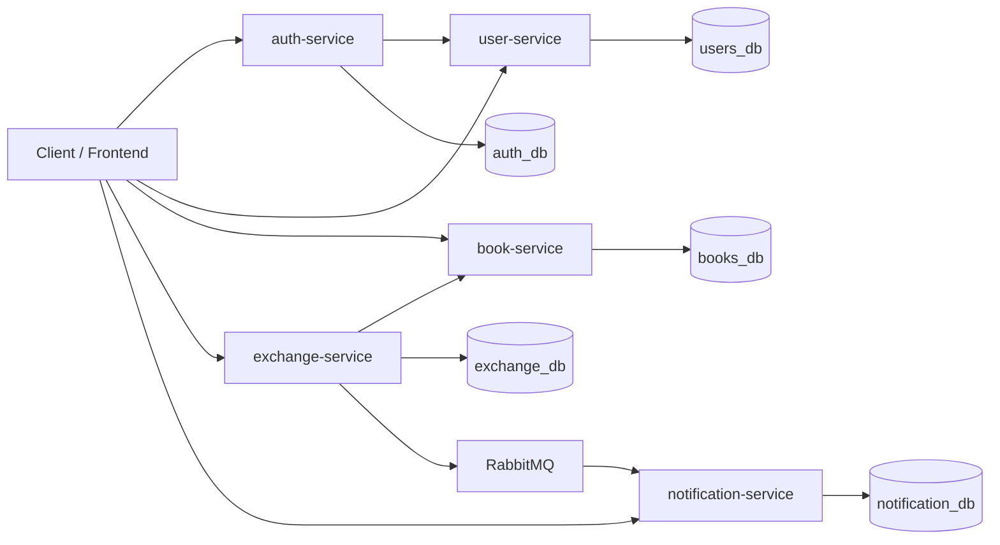
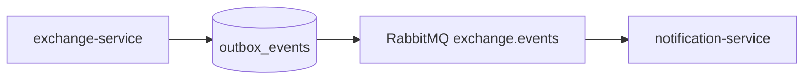

# Second Shelf

Second Shelf is a multi-module Spring Boot backend for exchanging books between users.
The project is split into five services with isolated PostgreSQL databases. User-facing
operations are synchronous REST calls, while exchange notifications are delivered
asynchronously through RabbitMQ via the outbox pattern.

## Project Structure

| Service | Port | Responsibility | Database |
| --- | --- | --- | --- |
| `auth-service` | `8080` | Registration, login, access token issuing, refresh token rotation, logout | `auth_db` |
| `user-service` | `8081` | User profiles, roles, blocking/unblocking, internal auth and claims APIs | `users_db` |
| `book-service` | `8082` | Public catalog, user's own books, visibility and book state transitions | `books_db` |
| `exchange-service` | `8083` | Exchange request workflow, synchronous book coordination, outbox event creation and publishing | `exchange_db` |
| `notification-service` | `8084` | Consumes exchange events and stores user notifications | `notification_db` |

The Maven root project contains these modules:

- `auth-service`
- `user-service`
- `book-service`
- `exchange-service`
- `notification-service`

## Architecture

### Synchronous User APIs

- There is no API gateway in the current repository. Clients call each service directly.
- `auth-service` exposes public authentication endpoints under `/api/auth`.
- `user-service`, `book-service`, `exchange-service`, and `notification-service` expose REST APIs for authenticated users.
- `auth-service` synchronously calls `user-service` internal endpoints to create users, validate credentials, and fetch current claims.
- `exchange-service` synchronously calls `book-service` internal endpoints to read book data and change book state during exchange processing.

### Asynchronous Notification Flow

- `exchange-service` writes domain events to its local `outbox_events` table in the same transaction as exchange state changes.
- A scheduled publisher in `exchange-service` reads pending outbox events and publishes them to RabbitMQ.
- `notification-service` consumes these events from RabbitMQ and creates persisted notifications.
- `notification-service` stores processed event ids to avoid duplicate notifications.

### RabbitMQ Role

- RabbitMQ is used only for asynchronous delivery of exchange domain events to `notification-service`.
- `exchange-service` publishes to topic exchange `exchange.events`.
- Event routing keys are the domain event names:
  - `exchange.request.created`
  - `exchange.request.accepted`
  - `exchange.request.declined`
  - `exchange.request.cancelled`
  - `exchange.request.completed`
- `notification-service` binds durable queue `notification.exchange-events` with routing key pattern `exchange.request.*`.

### Outbox Pattern Role

- Outbox records are created inside the same database transaction as `exchange_requests` changes.
- This prevents the "exchange saved, event lost" case when the HTTP workflow succeeds but RabbitMQ is temporarily unavailable.
- Pending records are polled by a scheduled task every `5000` ms by default.
- Publisher behavior in the current code:
  - reads up to `100` pending events ordered by `created_at`;
  - publishes JSON payloads to RabbitMQ;
  - marks events as `PUBLISHED` on success;
  - increments `attempts_count` on publish failure.

### Mermaid: High-Level Architecture



### Mermaid: Async Notification Flow



## Databases

`docker/postgres/init/01-create-extra-dbs.sql` creates five isolated PostgreSQL databases:

- `users_db`
- `auth_db`
- `books_db`
- `exchange_db`
- `notification_db`

Current schema by service:

### `user-service` -> `users_db`

- `users`: profile fields, password hash, `enabled`, timestamps.
- `user_roles`: many-to-one role mapping for each user.

### `auth-service` -> `auth_db`

- `refresh_tokens`: hashed refresh tokens (`token_hash`), owning `user_id`, expiration, revoke timestamp, creation timestamp.

### `book-service` -> `books_db`

- `books`: owner id, bibliographic fields, `visibility`, `status`, creation/update timestamps.

### `exchange-service` -> `exchange_db`

- `exchange_requests`: requested book, offered book, owner id, requester id, exchange status, optional message, timestamps.
- `outbox_events`: event metadata, serialized payload, outbox status, publish timestamp, attempts counter.

### `notification-service` -> `notification_db`

- `notifications`: recipient id, notification type, title, message, read status, related entity reference, timestamps.
- `processed_events`: consumed event ids used for idempotency.

## Authentication And Authorization

### Authentication

- Registration and login are handled by `auth-service`.
- Public auth endpoints in the current code: `/api/auth/ping`, `/api/auth/login`, `/api/auth/register`, `/api/auth/refresh`, `/api/auth/logout`, `/api/auth/logout-all`.
- `GET /api/auth/me` requires a valid bearer token.
- User credentials are stored in `user-service`.
- Passwords are hashed with `BCryptPasswordEncoder`.
- `auth-service` issues:
  - JWT access tokens;
  - opaque refresh tokens.
- Refresh tokens are not stored in plain text. `auth-service` stores only SHA-256 hashes in `refresh_tokens`.
- Refresh flow rotates the refresh token: the previous token is revoked and a new token is issued.
- Access token payload currently contains:
  - `sub` = username
  - `userId`
  - `roles`
- All API services validate JWTs locally using the shared `JWT_SECRET`.

### Authorization

- `user-service` admin endpoints under `/api/v1/admin/**` require role `ROLE_ADMIN`.
- `user-service` profile updates are additionally restricted to the profile owner via `@PreAuthorize("#id == principal.userId")`.
- `book-service`, `exchange-service`, and `notification-service` require a valid bearer token for protected API endpoints.
- `book-service` public catalog endpoint `/api/v1/books/public` is open without authentication.
- Internal service-to-service endpoints are hidden from Swagger and are protected by header `X-Internal-Token`.

### Internal Calls

- `auth-service` -> `user-service`
  - `POST /internal/users`
  - `POST /internal/auth/authenticate`
  - `GET /internal/users/{id}/claims`
- `exchange-service` -> `book-service`
  - `GET /internal/books/{id}`
  - `POST /internal/books/{id}/reserve`
  - `POST /internal/books/{id}/available`
  - `POST /internal/books/{id}/exchanged`

## Exchange Workflow

Current exchange workflow in `exchange-service`:

1. The requester creates an exchange request with:
   - `requestedBookId`
   - `offeredBookId`
   - optional `message`
2. `exchange-service` synchronously loads both books from `book-service`.
3. Validation on create:
   - requested and offered books must be different;
   - requester cannot request their own book;
   - requested book must be `PUBLIC` and `AVAILABLE`;
   - offered book must belong to requester;
   - offered book must be `PUBLIC` and `AVAILABLE`;
   - duplicate active request with the same book pair is rejected when status is `PENDING` or `ACCEPTED`.
4. A new exchange request is stored with status `PENDING`.
5. An outbox event `exchange.request.created` is recorded.
6. The owner of the requested book can accept or decline the request.
7. On accept:
   - only `PENDING` requests can be accepted;
   - both books are synchronously reserved in `book-service`;
   - conflicting pending requests involving the same books are automatically moved to `DECLINED`;
   - outbox events are recorded for the accepted request and for every auto-declined conflicting request.
8. On decline:
   - only the owner can decline;
   - only `PENDING` requests can be declined;
   - an outbox event `exchange.request.declined` is recorded.
9. On cancel:
   - only the requester can cancel;
   - `PENDING` and `ACCEPTED` requests can be cancelled;
   - if the request was `ACCEPTED`, both books are returned to `AVAILABLE`;
   - an outbox event `exchange.request.cancelled` is recorded.
10. On complete:
   - only the owner can complete;
   - only `ACCEPTED` requests can be completed;
   - both books are marked `EXCHANGED` and hidden (`PRIVATE`) in `book-service`;
   - an outbox event `exchange.request.completed` is recorded.

## Statuses

### Book Statuses

| Status | Meaning |
| --- | --- |
| `AVAILABLE` | The book can participate in exchange operations. |
| `RESERVED` | The book is locked by an accepted exchange request. |
| `EXCHANGED` | The book is marked as exchanged and can no longer be modified through normal owner operations. |

Related visibility states in `book-service`:

| Visibility | Meaning |
| --- | --- |
| `PUBLIC` | Visible in the public catalog and allowed for exchange creation. |
| `PRIVATE` | Not shown in the public catalog. |

### Exchange Statuses

| Status | Meaning |
| --- | --- |
| `PENDING` | Request created and waiting for owner decision. |
| `ACCEPTED` | Request accepted, both books reserved. |
| `DECLINED` | Request explicitly declined or auto-declined because another request was accepted for the same books. |
| `CANCELLED` | Request cancelled by requester. |
| `COMPLETED` | Exchange finished, both books marked as exchanged. |

### Notification Statuses

| Status | Meaning |
| --- | --- |
| `UNREAD` | Notification has not been read by the recipient. |
| `READ` | Notification was marked as read. |

Current notification types generated from exchange events:

- `EXCHANGE_REQUEST_CREATED`
- `EXCHANGE_REQUEST_ACCEPTED`
- `EXCHANGE_REQUEST_DECLINED`
- `EXCHANGE_REQUEST_CANCELLED`
- `EXCHANGE_REQUEST_COMPLETED`

## Local Startup With Docker Compose

### Prerequisites

- Docker
- Docker Compose

### Start

1. Create a local env file:

   ```bash
   cp .env.example .env
   ```

2. If needed, adjust credentials, ports, JWT secret, and seed admin values in `.env`.

3. Build and start the full stack:

   ```bash
   docker compose up --build
   ```

4. To stop the stack:

   ```bash
   docker compose down
   ```

5. To stop and remove PostgreSQL volume data:

   ```bash
   docker compose down -v
   ```

### Exposed Local Ports

| Component | Default URL |
| --- | --- |
| `auth-service` | `http://localhost:8080` |
| `user-service` | `http://localhost:8081` |
| `book-service` | `http://localhost:8082` |
| `exchange-service` | `http://localhost:8083` |
| `notification-service` | `http://localhost:8084` |
| PostgreSQL | `localhost:5432` |
| RabbitMQ AMQP | `localhost:5672` |
| RabbitMQ Management UI | `http://localhost:15672` |

## Environment Variables

For standard `docker compose up`, the variables from `.env.example` are sufficient.

### Shared

| Variable | Purpose |
| --- | --- |
| `INTERNAL_TOKEN` | Shared secret for internal `/internal/**` endpoints between services. |
| `JWT_SECRET` | Shared HMAC secret for JWT signing and validation across services. |
| `JWT_ACCESS_EXPIRATION_MS` | Access token lifetime in milliseconds. |
| `JWT_REFRESH_EXPIRATION_MS` | Refresh token lifetime in milliseconds. |

### PostgreSQL

| Variable | Purpose |
| --- | --- |
| `POSTGRES_USER` | PostgreSQL superuser/login used by the container. |
| `POSTGRES_PASSWORD` | PostgreSQL password. |
| `POSTGRES_DB` | Initial PostgreSQL database used by the container startup. |
| `POSTGRES_PORT` | Host port mapped to PostgreSQL `5432`. |
| `DB_HOST` | Database host when running services outside Compose. |
| `DB_USERNAME` | Service database username. |
| `DB_PASSWORD` | Service database password. |
| `USER_DB_NAME` | `user-service` database name. |
| `AUTH_DB_NAME` | `auth-service` database name. |
| `BOOK_DB_NAME` | `book-service` database name. |
| `EXCHANGE_DB_NAME` | `exchange-service` database name. |
| `NOTIFICATION_DB_NAME` | `notification-service` database name. |

### RabbitMQ

| Variable | Purpose |
| --- | --- |
| `RABBITMQ_HOST` | RabbitMQ host when running services outside Compose. |
| `RABBITMQ_PORT` | Host port mapped to RabbitMQ `5672`. |
| `RABBITMQ_USERNAME` | RabbitMQ username. |
| `RABBITMQ_PASSWORD` | RabbitMQ password. |

### Service Ports

| Variable | Purpose |
| --- | --- |
| `AUTH_SERVICE_PORT` | External auth-service port. |
| `USER_SERVICE_PORT` | External user-service port. |
| `BOOK_SERVICE_PORT` | External book-service port. |
| `EXCHANGE_SERVICE_PORT` | External exchange-service port. |
| `NOTIFICATION_SERVICE_PORT` | External notification-service port. |

### Inter-Service Base URLs

| Variable | Purpose |
| --- | --- |
| `USER_SERVICE_BASE_URL` | Base URL used by `auth-service` when not using Compose service DNS. |
| `BOOK_SERVICE_BASE_URL` | Base URL used by `exchange-service` when not using Compose service DNS. |

### Seed Admin

| Variable | Purpose |
| --- | --- |
| `SEED_ADMIN_USERNAME` | Admin username created on startup if it does not exist. |
| `SEED_ADMIN_PASSWORD` | Admin password created on startup if it does not exist. |
| `SEED_ADMIN_EMAIL` | Admin email created on startup if it does not exist. |

### Optional Exchange Outbox Tuning

These variables are supported by the current code but are not required for the default Compose setup:

| Variable | Default | Purpose |
| --- | --- | --- |
| `EXCHANGE_OUTBOX_PUBLISHER_ENABLED` | `true` | Enables the scheduled outbox publisher. |
| `EXCHANGE_OUTBOX_PUBLISHER_FIXED_DELAY_MS` | `5000` | Delay between outbox polling iterations. |

## Swagger URLs

Each service exposes Swagger UI at `/swagger-ui.html` and OpenAPI JSON at `/v3/api-docs`.

| Service | Swagger UI | OpenAPI JSON |
| --- | --- | --- |
| `auth-service` | `http://localhost:8080/swagger-ui.html` | `http://localhost:8080/v3/api-docs` |
| `user-service` | `http://localhost:8081/swagger-ui.html` | `http://localhost:8081/v3/api-docs` |
| `book-service` | `http://localhost:8082/swagger-ui.html` | `http://localhost:8082/v3/api-docs` |
| `exchange-service` | `http://localhost:8083/swagger-ui.html` | `http://localhost:8083/v3/api-docs` |
| `notification-service` | `http://localhost:8084/swagger-ui.html` | `http://localhost:8084/v3/api-docs` |

## Current Limitations And Development Directions

- Clients currently call each backend service directly. There is no API gateway or unified backend entry point.
- `exchange-service` performs synchronous book state changes and uses best-effort compensation when reserve/release rollback fails. Manual investigation may still be needed in failure scenarios.
- The exchange completion model is still MVP-level: only the book owner completes the request. There is no dual confirmation from both participants.
- `notification-service` creates in-app notifications only. There is no email, push, SMS, or websocket delivery layer.
- Notification text is built from numeric ids (`userId`, `bookId`, `exchangeRequestId`) and is not enriched with usernames or book titles.
- The public catalog query currently includes `PUBLIC` books with statuses `AVAILABLE` and `RESERVED`, so reserved books remain visible in the catalog.
- Outbox publishing tracks `attempts_count`, but there is no dead-letter queue, max retry policy, or retry backoff configuration in the current implementation.
