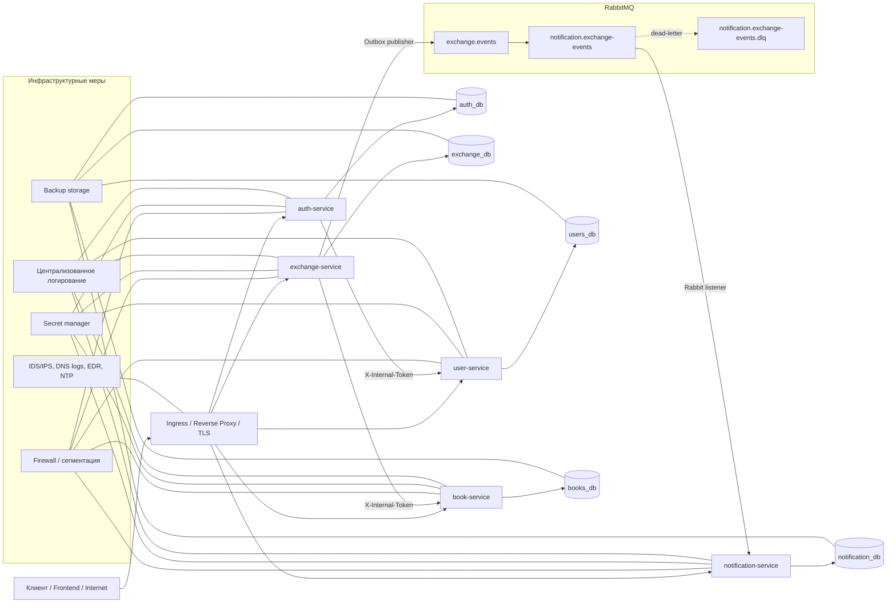

# 06. Архитектура безопасности

## Логическая схема

## Зоны доверия

### 1. Публичная зона

Сюда относятся входящие пользовательские запросы к:

- `auth-service`
- `user-service`
- `book-service`
- `exchange-service`
- `notification-service`

Защита этой зоны требует TLS, публикации только необходимых endpoint'ов и фильтрации трафика.

### 2. Прикладная сервисная зона

Здесь находятся сами Spring Boot сервисы с бизнес-логикой:

- `auth-service` выпускает JWT и refresh-токены;
- `user-service` хранит профиль и проверяет пароль;
- `book-service` реализует owner-based доступ к книгам;
- `exchange-service` управляет состояниями обмена и outbox;
- `notification-service` потребляет события и хранит уведомления.

### 3. Внутренняя сервис-сервис зона

Внутренние вызовы ограничены двумя направлениями:

- `auth-service -> user-service`
- `exchange-service -> book-service`

Эти вызовы отделены от публичных API с помощью `/internal/**` и `X-Internal-Token`.

### 4. Зона хранения данных

Каждый сервис использует собственную БД:

- `auth_db` для refresh-сессий;
- `users_db` для профилей, ролей и хэшей паролей;
- `books_db` для книг и их владельцев;
- `exchange_db` для заявок на обмен и outbox-событий;
- `notification_db` для уведомлений и обработанных event id.

Изоляция БД уменьшает риск единой точки компрометации, но не заменяет инфраструктурные ACL и раздельные учетные записи БД.

## Владение данными по сервисам

| Сервис | Зона владения данными | Типы данных |
| --- | --- | --- |
| `auth-service` | Сессии и токены | `userId`, refresh token hash, сроки действия, признаки отзыва |
| `user-service` | Профиль пользователя | `username`, `email`, `firstName`, `lastName`, `city`, `about`, password hash, roles, enabled |
| `book-service` | Каталог книг и владение | `ownerId`, сведения о книге, состояние публикации |
| `exchange-service` | Процесс обмена | `requesterId`, `ownerId`, message, статусы, подтверждения, снимки книг |
| `notification-service` | Производные уведомления | `userId`, title, message, relatedEntityId, read status |

## Прикладные меры безопасности

В коде уже реализованы:

- JWT для пользовательских API;
- refresh-токены и их ротация;
- хэширование паролей;
- `X-Internal-Token` для внутренних API;
- owner-based authorization;
- изолированные БД;
- outbox pattern;
- DLQ;
- health checks.

## Зависимость от инфраструктуры

Архитектура `Second Shelf` предполагает, что вне приложения будут обеспечены:

- TLS;
- firewall;
- централизованное логирование;
- backup storage;
- IDS/IPS;
- DNS-логирование;
- EDR/антивирус;
- синхронизация времени;
- secret manager.

Без этих мер прикладная архитектура не покрывает весь объем требований для системы класса `3-ИН`.
